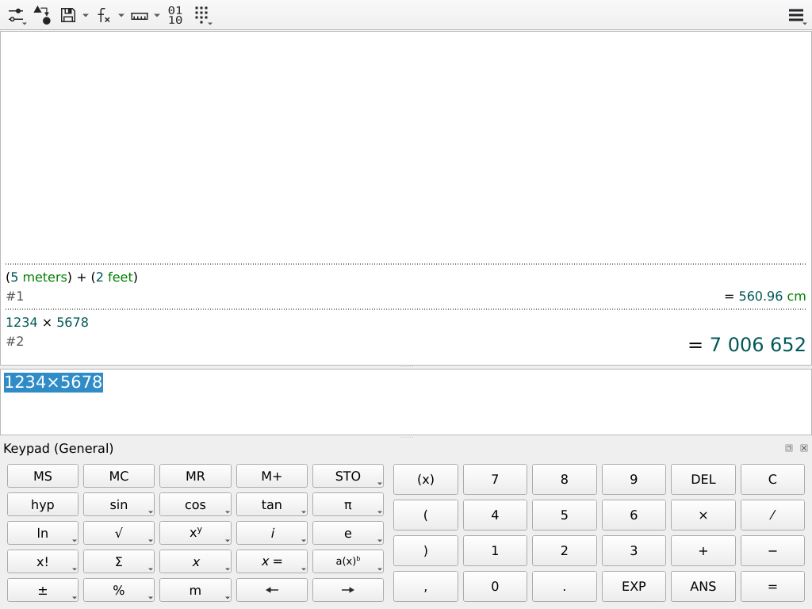

# Qalculate! 5.12.0 as a wk node

A **real Qt 6 Widgets application on a real libqalculate** — 32,470 lines of
C++ in the front end, and behind it the whole calculator: GMP 6.3.0,
MPFR 4.2.2 and libxml2 2.13.8 cross-compiled to `wasm32-wasip2`, with
libqalculate's entire unit, function, element and constant database compiled
into the binary as C string literals. It runs as a wk node, painting through
the wk QPA plugin onto the single RGBA8 surface wk gives a node.

```
cd plugins/qt-qalculate
mise run build      # or ./build.sh
mise run test       # runs it headless on wk's real runtime and checks the ANSWER
wk run plugins/qt-qalculate/example.wk    # from the repo root
```

`build.sh` needs `plugins/qt` built first (`build-host.sh` → `build-qtbase.sh`
→ `build-qpa.sh`, hours). It fetches six upstreams itself and vendors none of
them.



## It works

`./harness` ran the component on `PluginHost` — wk's own runtime, the one the
daemon uses — pumping one frame per iteration the way the compositor does:

```
surface opened
frame: 3703 dark px, 778378 light px
QALC platform=wk style=fusion families=1
STATE expr='5 m + 2 ft to cm' result='= 560.96 cm' hist=1 ... focus='ExpressionEdit'
the node evaluated `5 m + 2 ft to cm` -> `560.96 cm`
clicking the expression editor at (512, 507) to focus it
the expression editor has keyboard focus
Escape -- a key with no text at all -- cleared the editor
real key events typed `1234*5678` into the expression editor (it reads `1234×5678`)
STATE expr='1234×5678' result='= 7 006 652' hist=1 last='5 m + 2 ft to cm' ...
the node evaluated the typed expression -> `7006652`
STATE expr='1234×5678' result='= 7 006 652' hist=2 last='1234×5678' ...
Return committed it to the expression history
the history view repainted with the new answer
PASS
```

and the frames it dumped were **looked at** (`doc/qalculate-node.png` is one of
them), because a pixel histogram proves "not blank", never "the right window".
The window shows the toolbar with its **SVG** icons, so the statically-imported
`qsvg` icon engine decodes; the history view with two entries, syntax-coloured — the
parsed form `(5 meters) + (2 feet)` in green above its right-aligned answer
`= 560.96 cm`, then `1234 × 5678` above `= 7 006 652` in Qalculate's larger
result face; the expression editor with `1234×5678` selected; and the full
dockable General keypad laid out and painted.

Five independent claims, not one:

1. **It comes up.** `platform=wk`, `style=fusion`, `families=1` — the wk QPA
   plugin resolved statically and the compiled-in font registered.
2. **It is a widget frame.** ~3.7k dark pixels of text and button borders
   against ~778k light pixels of background at 1024×768.
3. **It COMPUTED.** `5 m + 2 ft to cm` → `560.96 cm`. That one string is the
   parser, the unit database, GMP, MPFR, the printer, and libqalculate's
   *threaded* `Calculator::calculate()` entry point running on this port's
   inline-thread patch. It arrived the way a workspace passes it — as the
   node's `args` — and was evaluated before the event loop even started.
4. **It is interactive.** A genuine `wasi:surface` pointer press/release
   focuses the editor; a genuine Escape (a key with **no** `text`, so it can
   only act through its key code) clears it; genuine key events **with** their
   `text` type `1234*5678`, which reads back as `1234×5678` because
   ExpressionEdit substitutes the multiplication sign as you type; the answer
   `7 006 652` appears; and a genuine Return commits it to the app's own
   expression history.
5. **The answer was drawn.** The pixels of the band the history view occupies
   changed with it.

Claim 3 is the one the whole port exists for, and it is asserted **by name**
rather than by pixels — see below.

## The one thing that mattered

libqalculate dispatches every timed calculation through pthreads. wasi-libc
defines `pthread_create` as a stub returning `ENOTSUP`. Measured on the
unpatched library, cross-compiled and run under `wasmtime -W exceptions`:

```
CALCULATOR->calculate(&m, "6*7", 2000, eo)  ->  rc=0 aborted=1 in 0 ms
```

So `Thread::start()` fails, every caller takes its `mstruct->setAborted()`
path, and **the GUI answers every single expression with the word "aborted"** —
in a window that paints perfectly, with a full keypad, a menu bar and a blinking
cursor. A pixel histogram would call that a pass, and anyone debugging it would
start on the QPA plugin, which is innocent. That is why the harness asserts on
the string in the history view and names `aborted` in its failure message.

`patches/libqalculate-0002-wasi-inline-threads.patch` is the fix, and the shape
of it is the interesting part. Every `run()` body in both projects —
`CalculateThread`, and the front end's `ViewThread` and `CommandThread` — is

```c++
while(true) { if(!read(&a)) break; ... }
```

a message loop that already stops cleanly when its queue runs dry. So on
`__wasi__` the messages go into an in-memory FIFO (byte-exact with the
`fwrite()` it replaces, because the readers read fixed scalar widths back),
`start()` only marks the thread live, and the body runs **inline on the
caller's stack** the next time anything calls `sleep_ms()`. Draining the queue
and returning is the loop's own exit condition, so not one `run()` body needed
touching.

`sleep_ms()` is the hook because every waiter in **both** projects already
spins on it immediately after handing the worker its messages —
`Calculator::calculate()`, `Calculator::convertTimeOut()`, `Calculator::abort()`,
`terminateThreads()`, and `QalculateWindow::setResult()` and `::executeCommand()`.
That is why the Qt front end's threading needed **no patch at all**, which the
recon had scoped at "3 call sites plus a Thread subclass".

**What is genuinely lost:** the `msecs` timeout. Upstream enforces it by
letting the calling thread watch the clock while the worker runs and calling
`abort()` if it overruns; with one stack there is nobody to watch, so a runaway
expression blocks the node rather than returning "timed out". The progress
dialog and its Cancel button are unreachable for the same reason — which at
least means nobody is shown a frozen one. This is the port's sharpest edge and
it is not hidden: it is in `example.wk`'s note and in the patch header.

## What was NOT the problem

The dependency chain was supposed to be the risk. It was not.

* **gmp, mpfr and libxml2 need zero patches.** They cross-compile to
  wasm32-wasip2 with wasi-sdk 34-rc.2 unmodified; only `--host` and the flag
  set in `build.sh` are needed. About six minutes for all three.
* **libqalculate needs two patches**, one of which is the `<pwd.h>` one-liner.
* **QtNetwork was never needed.** `QT += network` in `qalculate-qt.pro` is
  vestigial: there are zero `QNetwork*` uses anywhere in `src/`. The only
  QtNetwork classes are `QLocalSocket`/`QLocalServer` for the single-instance
  handshake, which is meaningless for a node — a wk node *is* one instance —
  and is compiled out by `patches/qalculate-qt-0002`.
* **ICU was never needed.** libqalculate uses it in exactly one function,
  `utf8_strdown()`, for case-insensitive matching of non-ASCII identifier
  names. `--without-icu` compiles out cleanly.
* **The only application C++ that had to change is the single-instance IPC.**
  A `QPlainTextEdit` subclass with a live completer, a `QTextEdit` history
  rendering HTML results, a dockable keypad, a dozen modal dialogs,
  `QSortFilterProxyModel`s and custom item delegates all cross-compiled as-is.
  The other two app patches are a static-plugin declaration and test
  scaffolding.

## What WAS surprising

* **Upstream ships no CMakeLists.txt.** qalculate-qt v5.12.0 is qmake-only, and
  wk's Qt is a genuine CMake `WASI` platform with no qmake mkspec. So this port
  writes its own build system: `cmake/CMakeLists.txt`, staged over the fetched
  tree. The obvious hazard is silent divergence on the next version bump, so
  the CMakeLists **globs** `src/*.cpp` and `build.sh` asserts the glob still
  equals the `.pro`'s `SOURCES` — an upstream file addition breaks the build
  loudly instead of quietly dropping a translation unit.
* **`git apply` silently skips patches that carry a `diff --git` header.** Every
  one of these source trees lives inside the wk repository, and git then treats
  the patch's paths as repository-relative, prints
  `Skipped patch 'libqalculate/util.cc'` and exits **0**. The build fails a
  hundred lines later with exactly the error the patch was written to fix. The
  patches here are therefore plain unified diffs, as the ones in
  `plugins/qt-torrentfileeditor103` are. Do not regenerate them with
  `git diff` without stripping those two lines.
* **`find_package(Qt6 COMPONENTS Svg)` cannot see a module in a second
  prefix.** `Qt6Config.cmake` searches for its components with `NO_DEFAULT_PATH`
  against a path list derived from its own location, so with qtbase in
  `plugins/qt/sysroot` and qtsvg in this port's `./sysroot` it fails with
  "Expected Config file at *&lt;qtbase&gt;*/lib/cmake/Qt6Svg/… does NOT exist"
  while the module is sitting right there. `find_package(Qt6Svg)` by its own
  package name goes through the ordinary `CMAKE_PREFIX_PATH` search and finds
  it.
* **Qalculate auto-calculates as you type.** The answer to a half-typed
  expression appears in the history view without anyone pressing anything —
  which means the whole parse → evaluate → print → paint pipeline runs once per
  keystroke inside the frame-paced event dispatcher, and it keeps up. It also
  means `result` alone cannot tell "the live preview updated" from "Return
  committed the calculation", which is why the selftest narrates the app's own
  expression history and the harness asserts on that instead.

## Known gaps

* **No calculation timeout** — see above. A runaway expression blocks the node.
* **No IME**, so the Unicode operators (`×`, `÷`, `√`, `π`) cannot be typed
  directly. The on-screen keypad covers all of them, and `*`, `/`, `sqrt()`,
  `pi` all work from the keyboard.
* **Exchange rates are compiled in and already stale** in the v5.12.0 tarball,
  and `--without-libcurl` means they are never refreshed. Currency conversion
  produces out-of-date numbers *quietly* rather than erroring.
  `plugins/curl/curl-8.11.1/lib/.libs/libcurl.a` is already a wasm32-wasip2
  static libcurl and blocking sockets work over the fabric, so this is a later
  milestone rather than a dead end.
* **Plot opens and does nothing.** `--without-gnuplot-call` leaves the dialog
  linked (`Calculator::plotVectors` is still exported) but there is no gnuplot
  to exec, and no exec.
* **GMP is `--disable-assembly`**, i.e. the generic C `mpn` path. Correct but
  slower than native; noticeable only on very large bignum work.
* **Clipboard is in-process.** The app copies and pastes within itself; the
  node log shows `Data set on unsupported clipboard mode` from the QPA. A
  guest↔host clipboard bridge is separate work.
* **No window decorations**: the main window fills the surface, dialogs float
  above it.

## Layout

```
build.sh                 six cross-builds and a link; read its header first
cmake/CMakeLists.txt     OUR build system for a qmake-only upstream
patches/                 five diffs and a README explaining each one
harness/                 runs the node on PluginHost and asserts on the answer
doc/qalculate-node.png   a frame, looked at
example.wk               self-contained workspace: `wk run` it
Dockerfile               FROM scratch; everything is inside the component
```

Derived and gitignored: `tarballs/ src/ build/ sysroot/ gen/ logs/ fonts/
*.wasm harness/target/`. `./sysroot` is this port's own install prefix — the
four C/C++ libraries *and* Qt6::Svg — layered on `plugins/qt/sysroot`. Nothing
here ever writes into `plugins/qt`.
