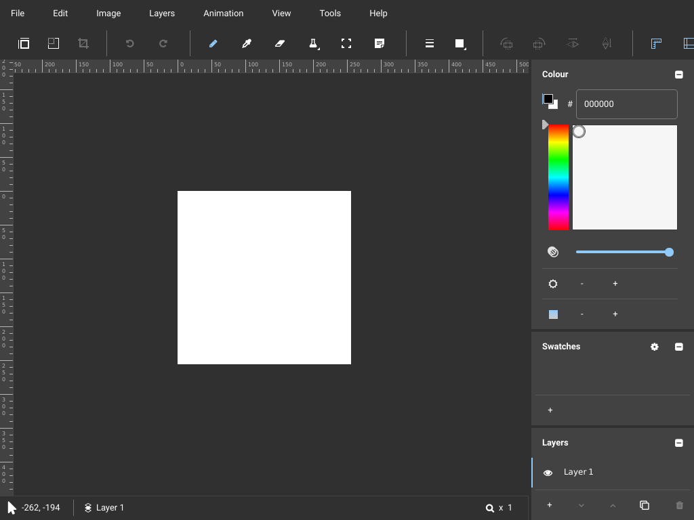

# Slate — a real Qt Quick application as a wk node

[Slate](https://github.com/mitchcurtis/slate) is a pixel-art and tile-map
editor by Mitch Curtis (a Qt Quick Controls maintainer at The Qt Company):
~29,000 lines of C++ and 105 QML files, GPL-3.0. This plugin cross-compiles it
to `wasm32-wasip2` and runs it as a wk node, drawing into the node's single
RGBA8 surface through `plugins/qt`'s wk QPA plugin.

Pinned to commit `e5cf5b6c66f21d4e5a6f7c42f497b1d29115b432`, and to a commit
rather than a tag on purpose: Slate's newest tag, v0.9.0 (2020), still asks for
Qt 5.12. The Qt 6 port is unreleased master.

    mise run build      # ./slate.wasm            (needs plugins/qt built first)
    mise run test       # runs it headless and writes a frame to /tmp/slate.ppm

## It works



*The frame the harness read back out of the node's surface — 1024x768, exactly
as presented. `doc/slate-node-file-menu.png` is the second frame, after the
synthetic click.*

`mise run test` spawns the component through wk-server's real `PluginHost`,
plays the per-frame role the compositor normally plays, and reads the presented
pixels back:

```
surface opened after 340.761042ms
frame 1024x768: 678125 dark, 15936 mid, 92371 bright px
frame written to /tmp/slate.ppm
pointer click at (26, 19): 6819 pixels changed
frame written to /tmp/slate.ppm.click.ppm
```

The frame is a complete Slate window: the menu bar, the icon toolbar (Typicons
and FontAwesome glyphs, shaped by HarfBuzz), both rulers with their tick
labels, the white canvas of a new project, the Colour panel with a live hue
gradient, Swatches, the Layers panel, and the status bar's cursor readout. The
second frame is the same window with the **File menu open** — which is why the
click test aims there: a Quick menu becomes a second `QWindow`, so it also
proves `QFbScreen` z-orders more than one top-level into the one wk surface.

A pixel histogram only ever proves "not blank", so the harness always writes
the frame out for a human to look at. That is the check that catches a QPA
plugin painting something plausible and wrong, and it earned its keep twice
here.

## What this needed that did not exist yet

`plugins/qt` had cross-built qtbase and written the wk QPA plugin, and stopped
there: "qtdeclarative not attempted. Qt Quick is M4." So most of the work here
is M4.

* **`./build-hosttools.sh`** builds a *second* native Qt 6.8.4, with QtGui,
  into `./host`. `plugins/qt/host` is deliberately Gui-less, and
  qtdeclarative's `src/CMakeLists.txt:37` is
  `if(TARGET Qt::Gui AND TARGET Qt::qsb AND QT_FEATURE_qml_animation)` — no
  `qsb`, no Qt Quick at all, with one NOTE to say so. `qsb` comes from
  qtshadertools, which returns early without QtGui. We never load those
  compiled shaders (the node runs `QT_QUICK_BACKEND=software`), but there is no
  switch that says "build Quick without shaders".
* **`./build-qtdeclarative.sh`** cross-builds QtQml, QtQuick, Quick Controls
  (Basic/Fusion/Material/Universal/Imagine), Layouts, Templates, Dialogs and
  `Qt.labs.platform` into `./sysroot` — a prefix of its own, because
  `plugins/qt/sysroot` belongs to another plugin.
* **`./node/`** wraps upstream rather than patching it: upstream's
  `CMakeLists.txt` is `add_subdirectory()`d and the four wk-specific link lines
  are attached to its `app` target.

## The four things that cost the most

**1. `mmap` is `malloc` on wasi, and QtQml masks pointers back to a page.**
This is the one worth remembering for any wasi port. wasi-libc's
`libwasi-emulated-mman` implements `mmap` as `malloc` and `munmap` as `free`,
so it returns 8-byte-aligned memory where `mmap` returns page-aligned memory
(measured: `sysconf(_SC_PAGESIZE)` is 65536, `mmap(65536)` returns `0x11498`).
`qv4persistent.cpp` allocates one page per block of persistent JS values and
recovers each page's header from any value inside it by masking the pointer
down to a page boundary. Unaligned, that mask lands on an unrelated address.
The app loaded all of its QML, started evaluating bindings, and then died in
the garbage collector:

```
0: QV4::markPersistentValues(QV4::GCStateMachine*, ...)
3: QV4::MemoryManager::runGC()
memory fault at wasm address 0xffff00fc in linear memory of size 0x2d80000
```

`allocatePage()` asserts exactly this, so a debug build would have said so;
release silently corrupts. `aligned_alloc(65536, …)` does give real alignment
on wasi-libc's dlmalloc, so the wasi `OSAllocator` uses that. See
`patches/qtdeclarative-0002`.

**2. `QT_HOST_PATH` alone is not enough when there are two host trees.** Passing
`-DQT_HOST_PATH=./host` produced

```
Failed to find the host tool "Qt6::qmlaotstats". It is part of the Qt6QmlTools
package, but the package could not be found.
```

with `./host/lib/cmake/Qt6QmlTools` sitting right there.
`QT_HOST_PATH_CMAKE_DIR` defaults to the host path *recorded inside
plugins/qt/sysroot when qtbase was configured*, so the two ended up naming
different trees — and `qt_internal_find_tool` sets `CMAKE_PREFIX_PATH` from one
while prepending the other to `CMAKE_FIND_ROOT_PATH`, which with
`FIND_ROOT_PATH_MODE_PACKAGE=ONLY` matches nothing. Both must be passed.

**3. libc++ 23 requires `operator[]` on random-access iterators.**
`std::sort`'s heap phase now writes `__first[__child]`; older libc++ wrote
`*(__first + n)`. `QTaggedIterator` has every other random-access operator and
not that one, so `qv4sequenceobject.cpp` will not compile. The proper fix is one
line in qtbase, which this plugin must not touch, so QML sequence sorting goes
through a materialised copy instead (`patches/qtdeclarative-0003`).

**4. A static QML module needs its *plugin* linked, not just its library.**
`qt_add_qml_module(slate URI "Slate")` builds `slate` and `slateplugin`;
upstream's app links only `slate`, which is correct on a shared Qt where the
plugin is found on the import path at runtime. There is no `dlopen` here, so:

```
qrc:/qml/main.qml:28:1: module "Slate" is not installed
```

after everything else — the wk platform plugin, QtQuick, Controls and Layouts —
had resolved perfectly.

## Known gaps, honestly

* **Menu popups have no background** — and it is the *same* cause as the next
  item, which is why it is worth stating precisely. The File menu opens, is
  composited over the main window and takes input, but only its text and
  separators paint; the ruler shows through where the dark panel should be.
  That is not the QPA plugin. Material's `Menu.qml:53-65` gives its background
  `layer.enabled: control.Material.elevation > 0` with
  `layer.effect: RoundedElevationEffect`, and that chain ends in
  `impl/RectangularGlow.qml:185`, a **`ShaderEffect`** — so on the software
  adaptation the whole layered background renders as nothing, shadow and
  Rectangle together. Every elevated Material popup is affected, not just
  menus. Workarounds without touching the QPA: `Material.elevation: 0` (the
  plain Rectangle then draws), or `QT_QUICK_CONTROLS_STYLE=Basic`.

  Demonstrated rather than deduced —
  `mise run test` accepts trailing `KEY=VALUE` environment, so

      ./harness/target/release/slate-harness ./slate.wasm /tmp/basic.ppm 400 \
          QT_QUICK_CONTROLS_STYLE=Basic

  produces `doc/slate-node-file-menu-basic.png`: the same menu, same
  compositing path, **fully opaque background**. Popups are fine; the layer
  effect is not.
* **The saturation/lightness picker is blank.**
  `app/qml/ui/SaturationLightnessPicker.qml:16` is a `ShaderEffect` too. Known
  before starting; the hue strip next to it is a plain gradient and renders
  fine.
* **`Cannot append ToolSeparator to a QML list of QQuickAbstractButton*`** is
  logged once at startup. Upstream's, not ours, and cosmetic.
* **Nothing has been saved or opened yet.** The file dialogs come from
  `Qt.labs.platform`, which falls back to QtWidgets dialogs here; that path is
  built and linked but no test drives it. Wire a BindMount to `/work` (see the
  `Dockerfile`) and try it.
* **The auto-swatch panel will stay empty.** `lib/autoswatchmodel.h` runs its
  scan on a `QThread`, and there are no threads on wasip2. It links and does
  nothing, which is the good failure mode.
* **No `wk images build` was run.** The `Dockerfile` here is written and
  reviewed but the image was not built; the harness runs the raw component with
  the same environment the Dockerfile sets.
* **Not registered in `workspace.wk`.** Adding the `docker://` dependency entry
  means editing a file another agent is working in. The three lines to add are
  in the `Dockerfile`'s header comment.

## Layout

| path | what |
|---|---|
| `build-hosttools.sh` | native Qt 6.8.4 + `qsb` → `./host` |
| `build-qtdeclarative.sh` | QtQml/QtQuick/Controls for wasm32-wasip2 → `./sysroot` |
| `build.sh` | fetches Slate, patches, builds → `./slate.wasm` |
| `node/` | the wrapper CMake + `wkslate.cpp` (static plugin imports, wk defaults) |
| `patches/` | 3 to qtdeclarative, 1 to Slate, each with its reason |
| `harness/` | a standalone crate that runs the node headless and proves it paints |
| `Dockerfile` | the node image |
